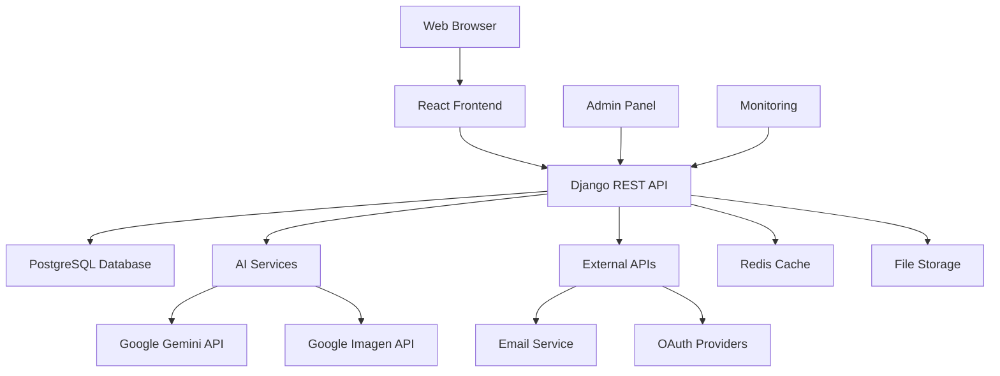
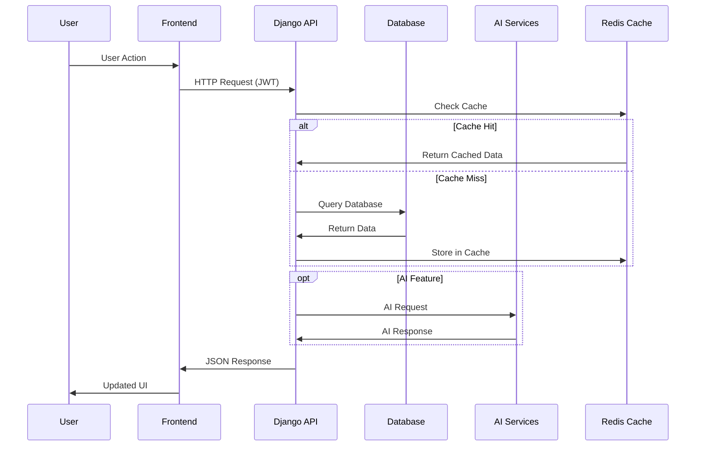
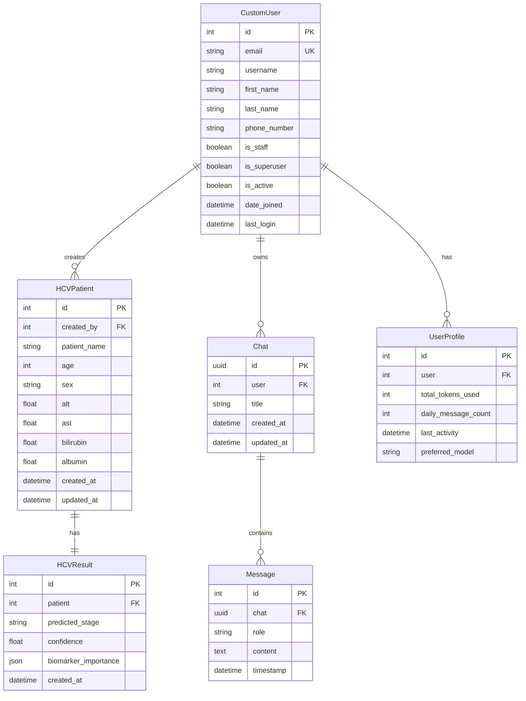
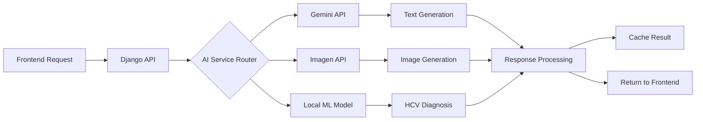
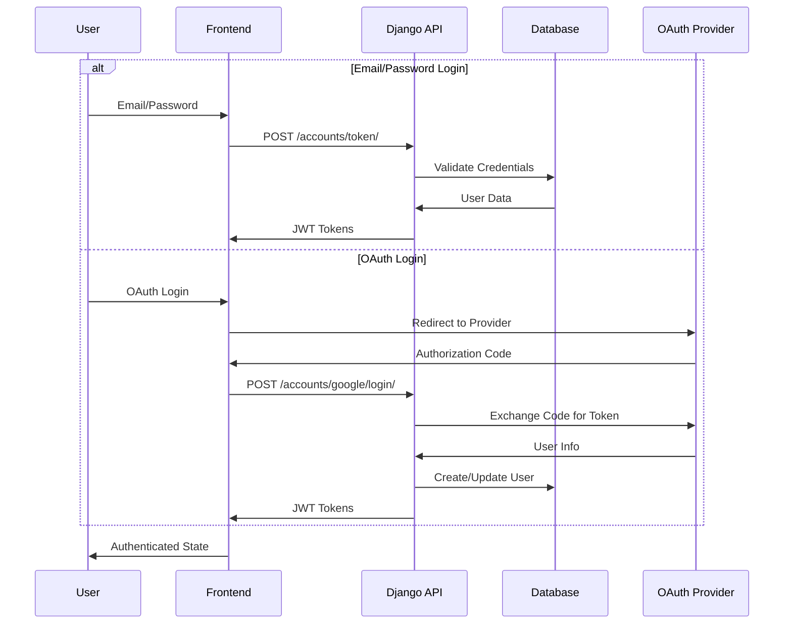
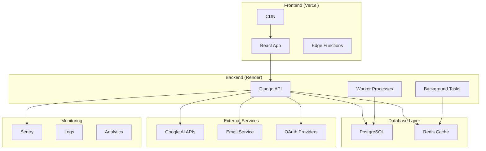

# Architecture Overview

<div align="center">
  <h2>🏗️ HepatoCAI System Architecture</h2>
  <p>Comprehensive overview of the HepatoCAI platform architecture</p>
</div>

---

## 📋 Table of Contents

- [System Overview](#system-overview)
- [High-Level Architecture](#high-level-architecture)
- [Backend Architecture](#backend-architecture)
- [Frontend Architecture](#frontend-architecture)
- [Database Design](#database-design)
- [AI Integration](#ai-integration)
- [Security Architecture](#security-architecture)
- [Deployment Architecture](#deployment-architecture)
- [Performance Considerations](#performance-considerations)
- [Scalability](#scalability)

## 🎯 System Overview

HepatoCAI is a modern web-based platform designed to provide AI-powered Hepatitis C information and diagnostic tools. The system follows a microservices-oriented architecture with clear separation of concerns.

### Core Components



### Technology Stack

| Layer              | Technology                        | Purpose                       |
| ------------------ | --------------------------------- | ----------------------------- |
| **Frontend**       | React 18, Material-UI, Vite       | User interface and experience |
| **Backend**        | Django 5.2, Django REST Framework | API and business logic        |
| **Database**       | PostgreSQL                        | Data persistence              |
| **Caching**        | Redis                             | Performance optimization      |
| **AI Services**    | Google Gemini, Imagen             | AI-powered features           |
| **Authentication** | JWT, OAuth                        | Security and access control   |
| **Deployment**     | Render, Vercel                    | Cloud hosting                 |

## 🏗️ High-Level Architecture

### System Architecture Diagram

```
┌─────────────────────────────────────────────────────────────────┐
│                           Frontend Layer                        │
├─────────────────────────────────────────────────────────────────┤
│  React Application (SPA)                                      │
│  ├── Components (Material-UI)                                 │
│  ├── State Management (TanStack Query)                        │
│  ├── Routing (React Router)                                   │
│  └── Authentication (JWT)                                     │
└─────────────────────┬───────────────────────────────────────────┘
                      │ HTTPS/REST API
┌─────────────────────▼───────────────────────────────────────────┐
│                        API Gateway Layer                        │
├─────────────────────────────────────────────────────────────────┤
│  Django REST Framework                                         │
│  ├── Authentication & Authorization                            │
│  ├── Rate Limiting                                            │
│  ├── Request/Response Serialization                           │
│  └── API Documentation (OpenAPI)                              │
└─────────────────────┬───────────────────────────────────────────┘
                      │
┌─────────────────────▼───────────────────────────────────────────┐
│                      Business Logic Layer                       │
├─────────────────────────────────────────────────────────────────┤
│  Django Applications                                           │
│  ├── Users Management                                          │
│  ├── AI Assistant                                             │
│  ├── Diagnosis System                                         │
│  └── Analytics & Reporting                                    │
└─────────────────────┬───────────────────────────────────────────┘
                      │
┌─────────────────────▼───────────────────────────────────────────┐
│                        Data Layer                              │
├─────────────────────────────────────────────────────────────────┤
│  ├── PostgreSQL Database                                       │
│  ├── Redis Cache                                              │
│  ├── File Storage                                             │
│  └── External APIs                                            │
└─────────────────────────────────────────────────────────────────┘
```

### Component Interaction Flow



## 🔧 Backend Architecture

### Django Project Structure

```
backend/
├── backend/                 # Project configuration
│   ├── __init__.py
│   ├── settings.py         # Django settings
│   ├── urls.py             # URL routing
│   ├── wsgi.py             # WSGI application
│   └── asgi.py             # ASGI application
│
├── users/                   # User management app
│   ├── models.py           # User models
│   ├── views.py            # Authentication views
│   ├── serializers.py      # API serializers
│   ├── urls.py             # App URLs
│   ├── admin.py            # Admin interface
│   └── tests.py            # Unit tests
│
├── diagnosis/               # Diagnostic system app
│   ├── models.py           # Patient/diagnosis models
│   ├── views.py            # Diagnosis APIs
│   ├── AiDiagnosisTool/    # AI model integration
│   ├── serializers.py      # Data serialization
│   └── resources.py        # Data export
│
├── aiassistant/             # AI assistant app
│   ├── models.py           # Chat models
│   ├── views.py            # Chat APIs
│   ├── AiModels/           # AI integrations
│   └── serializers.py      # Message serialization
│
├── utils/                   # Shared utilities
│   ├── responses.py        # Standard responses
│   ├── security.py         # Security utilities
│   ├── performance.py      # Performance monitoring
│   └── ip_utils.py         # IP utilities
│
├── static/                  # Static files
├── media/                   # Media files
├── logs/                    # Application logs
└── tests/                   # Integration tests
```

### Django Apps Architecture

#### Users App

```python
# Core user management functionality
class CustomUser(AbstractUser):
    # Extended user model with healthcare-specific fields

class UserManagementView(APIView):
    # Admin user management

class ProfileViewSet(viewsets.ViewSet):
    # User profile operations
```

#### Diagnosis App

```python
# HCV diagnosis and patient management
class HCVPatient(models.Model):
    # Patient information and biomarkers

class HCVResult(models.Model):
    # AI diagnosis results

class DiagnoseAPIView(APIView):
    # Main diagnosis endpoint
```

#### AI Assistant App

```python
# AI-powered chat functionality
class Chat(models.Model):
    # Chat sessions

class Message(models.Model):
    # Individual messages

class ChatMessageView(APIView):
    # Chat API endpoints
```

### API Design Patterns

#### RESTful Endpoints

```python
# Standard REST patterns
GET    /api/resource/           # List resources
POST   /api/resource/           # Create resource
GET    /api/resource/{id}/      # Retrieve resource
PUT    /api/resource/{id}/      # Update resource
DELETE /api/resource/{id}/      # Delete resource
```

#### Response Format Standardization

```python
class StandardResponse:
    @staticmethod
    def success(data=None, message="Success", **kwargs):
        return Response({
            'success': True,
            'data': data,
            'message': message,
            'timestamp': timezone.now().isoformat(),
            **kwargs
        })

    @staticmethod
    def error(message, status_code=400, **kwargs):
        return Response({
            'success': False,
            'error': {
                'message': message,
                **kwargs
            },
            'timestamp': timezone.now().isoformat()
        }, status=status_code)
```

## 🎨 Frontend Architecture

### React Application Structure

```
frontend/src/
├── components/              # Reusable components
│   ├── common/             # Common UI components
│   ├── forms/              # Form components
│   ├── layout/             # Layout components
│   ├── admin/              # Admin-specific components
│   └── landingPageComponents/ # Landing page sections
│
├── pages/                   # Page components
│   ├── auth/               # Authentication pages
│   ├── admin/              # Admin dashboard pages
│   ├── diagnosis/          # Diagnosis pages
│   ├── public/             # Public pages
│   └── blogs/              # Blog pages
│
├── hooks/                   # Custom React hooks
│   ├── AuthContext.jsx     # Authentication context
│   ├── useAuth.js          # Authentication hook
│   └── useLocalStorage.js  # Local storage hook
│
├── services/                # API services
│   ├── api.js              # Base API client
│   ├── auth.js             # Authentication service
│   ├── diagnosis.js        # Diagnosis API calls
│   └── ai.js               # AI service integration
│
├── config/                  # Configuration files
│   ├── constants.js        # Application constants
│   ├── performance.js      # Performance optimization
│   └── theme.js            # Material-UI theme
│
└── assets/                  # Static assets
    ├── images/
    └── styles/
```

### State Management

#### Context API Pattern

```javascript
// Authentication context
const AuthContext = createContext();

export const AuthProvider = ({ children }) => {
  const [user, setUser] = useState(null);
  const [loading, setLoading] = useState(true);

  // Authentication logic

  return (
    <AuthContext.Provider value={{ user, login, logout, loading }}>
      {children}
    </AuthContext.Provider>
  );
};
```

#### TanStack Query for Server State

```javascript
// API state management
const useUserProfile = () => {
  return useQuery({
    queryKey: ["profile"],
    queryFn: () => api.get("/users/profile/me/"),
    staleTime: 5 * 60 * 1000, // 5 minutes
  });
};
```

### Component Architecture

#### Higher-Order Components

```javascript
// Protected route wrapper
const ProtectedRoute = ({ children }) => {
  const { user, loading } = useAuth();

  if (loading) return <LoadingSpinner />;
  if (!user) return <Navigate to="/signin" />;

  return children;
};
```

#### Material-UI Theme System

```javascript
const theme = createTheme({
  palette: {
    primary: {
      main: "#2563EB",
      light: "#60A5FA",
      dark: "#1E40AF",
    },
    secondary: {
      main: "#DC2626",
    },
  },
  typography: {
    fontFamily: "Inter, sans-serif",
  },
  components: {
    MuiButton: {
      styleOverrides: {
        root: {
          borderRadius: 8,
        },
      },
    },
  },
});
```

## 🗄️ Database Design

### Entity Relationship Diagram



### Database Indexes

```sql
-- Performance optimization indexes
CREATE INDEX idx_hcv_patient_created_by ON diagnosis_hcvpatient(created_by);
CREATE INDEX idx_hcv_patient_created_at ON diagnosis_hcvpatient(created_at);
CREATE INDEX idx_message_chat_timestamp ON aiassistant_message(chat_id, timestamp);
CREATE INDEX idx_user_email ON users_customuser(email);
CREATE INDEX idx_user_active ON users_customuser(is_active);
```

### Data Migration Strategy

```python
# Database migration example
class Migration(migrations.Migration):
    dependencies = [
        ('users', '0001_initial'),
    ]

    operations = [
        migrations.AddField(
            model_name='customuser',
            name='phone_verified_at',
            field=models.DateTimeField(null=True, blank=True),
        ),
        migrations.RunSQL(
            "CREATE INDEX CONCURRENTLY idx_user_phone_verified "
            "ON users_customuser(phone_verified_at) WHERE phone_verified_at IS NOT NULL;"
        ),
    ]
```

## 🤖 AI Integration

### AI Services Architecture



### Gemini AI Integration

```python
# AI assistant service
class GeminiAssistant:
    def __init__(self):
        self.client = genai.GenerativeModel('gemini-2.0-flash')

    async def generate_response(self, message, context=None):
        try:
            prompt = self._build_prompt(message, context)
            response = await self.client.generate_content_async(prompt)
            return self._process_response(response)
        except Exception as e:
            logger.error(f"Gemini API error: {e}")
            return self._fallback_response()

    def _build_prompt(self, message, context):
        system_prompt = """
        You are HcvInfoBot, an AI assistant specialized in Hepatitis C information.
        Provide accurate, helpful information while emphasizing the importance of
        consulting healthcare professionals for medical advice.
        """
        return f"{system_prompt}\n\nUser: {message}"
```

### Diagnostic AI Framework

```python
# AI diagnosis tool integration
class AiDiagnosisTool:
    def __init__(self, model_path=None):
        self.model = self._load_model(model_path)

    def predict_hcv_stage(self, biomarkers):
        """
        Predict HCV fibrosis stage from biomarkers
        """
        try:
            # Preprocess biomarkers
            features = self._preprocess_features(biomarkers)

            # Make prediction
            prediction = self.model.predict(features)
            confidence = self.model.predict_proba(features).max()

            # Get feature importance
            importance = self._get_feature_importance(features)

            return {
                'predicted_stage': self._map_prediction(prediction),
                'confidence': float(confidence),
                'biomarker_importance': importance
            }
        except Exception as e:
            logger.error(f"Diagnosis prediction error: {e}")
            raise DiagnosisError("Unable to generate prediction")
```

## 🛡️ Security Architecture

### Authentication Flow



### Security Layers

#### Input Validation

```python
# Comprehensive input validation
class SecurityValidator:
    @staticmethod
    def validate_input_data(data):
        """Validate all input data for security threats"""
        if not isinstance(data, dict):
            return False

        for key, value in data.items():
            if not SecurityValidator.validate_field(key, value):
                return False
        return True

    @staticmethod
    def validate_email_format(email):
        """Validate email format"""
        pattern = r'^[a-zA-Z0-9._%+-]+@[a-zA-Z0-9.-]+\.[a-zA-Z]{2,}$'
        return re.match(pattern, email) is not None
```

#### Rate Limiting

```python
# Rate limiting implementation
class RateLimitManager:
    @staticmethod
    def rate_limit_decorator(limit_type):
        def decorator(func):
            def wrapper(request, *args, **kwargs):
                if not RateLimitManager.check_rate_limit(request, limit_type):
                    return StandardResponse.error(
                        "Rate limit exceeded",
                        status_code=429
                    )
                return func(request, *args, **kwargs)
            return wrapper
        return decorator
```

#### Security Headers

```python
# Security middleware
class SecurityMiddleware:
    def __init__(self, get_response):
        self.get_response = get_response

    def __call__(self, request):
        response = self.get_response(request)

        # Add security headers
        response['X-Content-Type-Options'] = 'nosniff'
        response['X-Frame-Options'] = 'DENY'
        response['X-XSS-Protection'] = '1; mode=block'
        response['Strict-Transport-Security'] = 'max-age=31536000; includeSubDomains'

        return response
```

## 🚀 Deployment Architecture

### Multi-Environment Setup

```
Development → Staging → Production

┌─────────────────┐    ┌─────────────────┐    ┌─────────────────┐
│   Development   │    │     Staging     │    │   Production    │
├─────────────────┤    ├─────────────────┤    ├─────────────────┤
│ Local SQLite    │    │ PostgreSQL      │    │ PostgreSQL      │
│ Debug Mode      │    │ SSL Testing     │    │ SSL Enforced    │
│ Local Storage   │    │ Cloud Storage   │    │ CDN + Storage   │
│ Basic Logging   │    │ Full Logging    │    │ Monitoring      │
└─────────────────┘    └─────────────────┘    └─────────────────┘
```

### Cloud Infrastructure



## ⚡ Performance Considerations

### Backend Optimization

#### Database Query Optimization

```python
# Efficient query patterns
class HCVPatientViewSet(viewsets.ModelViewSet):
    def get_queryset(self):
        # Use select_related and prefetch_related
        return HCVPatient.objects.select_related(
            'created_by', 'hcv_result'
        ).prefetch_related(
            'created_by__groups'
        ).order_by('-created_at')

    def list(self, request):
        # Implement pagination
        queryset = self.get_queryset()
        page = self.paginate_queryset(queryset)
        serializer = self.get_serializer(page, many=True)
        return self.get_paginated_response(serializer.data)
```

#### Caching Strategy

```python
# Redis caching implementation
from django.core.cache import cache

class CachedAnalyticsView(APIView):
    def get(self, request):
        cache_key = f"analytics_{request.user.id}"
        data = cache.get(cache_key)

        if data is None:
            data = self.calculate_analytics()
            cache.set(cache_key, data, timeout=300)  # 5 minutes

        return StandardResponse.success(data)
```

### Frontend Optimization

#### Code Splitting

```javascript
// Lazy loading components
const LazyDashboard = lazy(() => import("./pages/Dashboard"));
const LazyDiagnosis = lazy(() => import("./pages/Diagnosis"));

// Route-based code splitting
<Routes>
  <Route
    path="/dashboard"
    element={
      <Suspense fallback={<Loading />}>
        <LazyDashboard />
      </Suspense>
    }
  />
</Routes>;
```

#### Bundle Optimization

```javascript
// vite.config.js
export default defineConfig({
  build: {
    rollupOptions: {
      output: {
        manualChunks: {
          vendor: ["react", "react-dom"],
          ui: ["@mui/material", "@mui/icons-material"],
          charts: ["recharts"],
          utils: ["axios", "date-fns"],
        },
      },
    },
  },
});
```

## 📈 Scalability

### Horizontal Scaling Strategy

#### Microservices Migration Path

```
Monolith → Modular Monolith → Microservices

Current: Single Django Application
Future: Separated Services
├── User Service
├── Diagnosis Service
├── AI Service
├── Notification Service
└── Analytics Service
```

#### Database Scaling

```python
# Database sharding preparation
class DatabaseRouter:
    def db_for_read(self, model, **hints):
        if model._meta.app_label == 'diagnosis':
            return 'diagnosis_db'
        elif model._meta.app_label == 'users':
            return 'users_db'
        return 'default'

    def db_for_write(self, model, **hints):
        return self.db_for_read(model, **hints)
```

#### Caching Hierarchy

```
Browser Cache → CDN → Redis → Database

┌─────────────┐
│ Browser     │ (Static assets, API responses)
└─────────────┘
       ↓
┌─────────────┐
│ CDN         │ (Static files, images)
└─────────────┘
       ↓
┌─────────────┐
│ Redis Cache │ (Database queries, sessions)
└─────────────┘
       ↓
┌─────────────┐
│ Database    │ (Persistent data)
└─────────────┘
```

### Load Balancing

#### Application Load Balancing

```yaml
# Load balancer configuration
upstream backend {
server backend1.hepatocai.com;
server backend2.hepatocai.com;
server backend3.hepatocai.com;
}

server {
listen 443 ssl;
server_name api.hepatocai.com;

location / {
proxy_pass http://backend;
proxy_set_header Host $host;
proxy_set_header X-Real-IP $remote_addr;
}
}
```

### Monitoring and Observability

#### Performance Metrics

```python
# Custom performance monitoring
class PerformanceMonitor:
    @staticmethod
    def monitor_db_queries(func):
        def wrapper(*args, **kwargs):
            start_time = time.time()
            with connection.cursor() as cursor:
                initial_queries = len(connection.queries)
                result = func(*args, **kwargs)
                query_count = len(connection.queries) - initial_queries
                duration = time.time() - start_time

                logger.info(
                    f"Function {func.__name__}: "
                    f"{query_count} queries in {duration:.2f}s"
                )
                return result
        return wrapper
```

---

This architecture documentation provides a comprehensive overview of the HepatoCAI system design. The architecture is designed to be scalable, maintainable, and secure while providing excellent performance and user experience.

**Last Updated**: January 13, 2025
**Version**: 1.0.0
